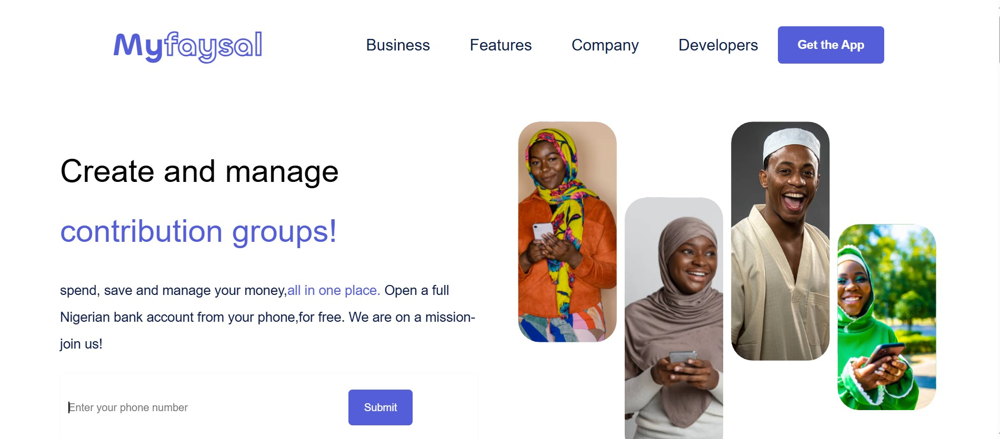

# Myfaysal | Digital Wallet & Financial Services in Nigeria

Myfaysal is a lightning-fast, responsive web application designed to simulate a modern digital wallet. Built with a focus on seamless user experience, financial accessibility, and highly optimized micro-interactions.

Project Screenshot

## 🚀 Features
*   **Interactive Dashboard:** Real-time wallet balance visualization with smooth, hardware-accelerated entrance animations.
*   **Responsive Mobile Navigation:** A fully functional, tactile mobile menu built for native-feeling navigation on smartphones.
*   **Optimized Micro-interactions:** Tactile button feedback and transition effects engineered strictly using `transform` and `opacity` for zero layout thrashing.
*   **Modern UI/UX:** Clean, secure-feeling aesthetic tailored for the Nigerian fintech ecosystem.

## 🛠️ Tech Stack
*   **Frontend:** Semantic HTML5, modern CSS3 (Tailwind CSS), and Vanilla JavaScript (ES6+).
*   **Performance:** GPU-accelerated CSS animations (`will-change`).

## ⚙️ Getting Started
1. Clone the repository: `git clone https://github.com/yourusername/myfaysal.git`
2. Open `index.html` in your preferred modern web browser.
3. No build steps or heavy dependencies required for the frontend UI.

## 📱 Mobile Experience
The application is built with a mobile-first approach. Inspect the site using browser developer tools (or open on a physical mobile device) to experience the slide-out navigation and touch-optimized action buttons.
